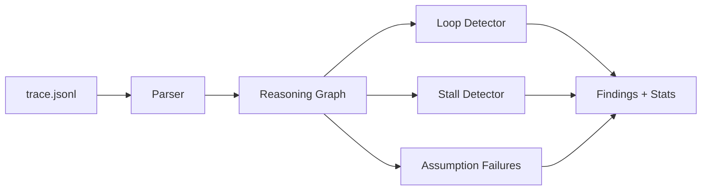

# agent-trace-map

Map agent **reasoning loops** from JSONL traces. Detect infinite retries,
stalls, shared assumption failures, and the critical path to a crash.

OpenTelemetry spans tell you a tool ran for 12 seconds. `atm` tells you the
agent called the same failing endpoint five times because it never updated
its premise.

## Architecture



## Install

```bash
npm install
npm run build
```

## CLI

```bash
# human-readable report
node dist/cli.js analyze examples/loop-trace.jsonl

# machine-readable
node dist/cli.js analyze examples/loop-trace.jsonl --json

# tune thresholds
node dist/cli.js analyze examples/clean-trace.jsonl --stall-ms 2000 --loop-threshold 2
```

Dev alias: `npm run cli -- analyze examples/loop-trace.jsonl`

## Trace format (JSONL)

One event per line:

```json
{
  "span_id": "t1",
  "parent_span_id": "p0",
  "kind": "tool",
  "prompt_ref": "prompts/fix.md",
  "outcome": "fetch user profile failed",
  "duration_ms": 100,
  "ts": "2026-01-15T11:00:00.100Z",
  "metadata": { "tool": "http_get", "ok": false, "error_code": "ECONNREFUSED" }
}
```

`kind` is one of `plan | tool | reflect | fail | commit`.
Required fields: `span_id`, `kind`, `duration_ms`.

## Library

```ts
import { parseJsonl, buildGraph, analyze } from "agent-trace-map";

const { events } = parseJsonl(jsonlText);
const graph = buildGraph(events);
const result = analyze(graph, { loopThreshold: 3, stallMs: 5000 });

for (const finding of result.findings) {
  console.log(finding.severity, finding.detector, finding.title);
}
```

## Detectors

| Detector | What it catches |
|---|---|
| `loop` | N consecutive spans with the same kind/prompt/outcome signature |
| `stall` | Spans longer than `stallMs`, or idle gaps between siblings |
| `assumption_failure` | Multiple failures sharing one root-cause signature |
| `critical_path` | Ancestor chain to the first hard failure (informational) |

## Examples

- `examples/clean-trace.jsonl` — healthy run, no findings
- `examples/loop-trace.jsonl` — retry storm + shared ECONNREFUSED failures
- `examples/stall-trace.jsonl` — 12s crawl stall

## Development

```bash
npm test
npm run typecheck
npm run build
```

See [docs/ARCHITECTURE.md](docs/ARCHITECTURE.md) for design details.

## License

MIT
