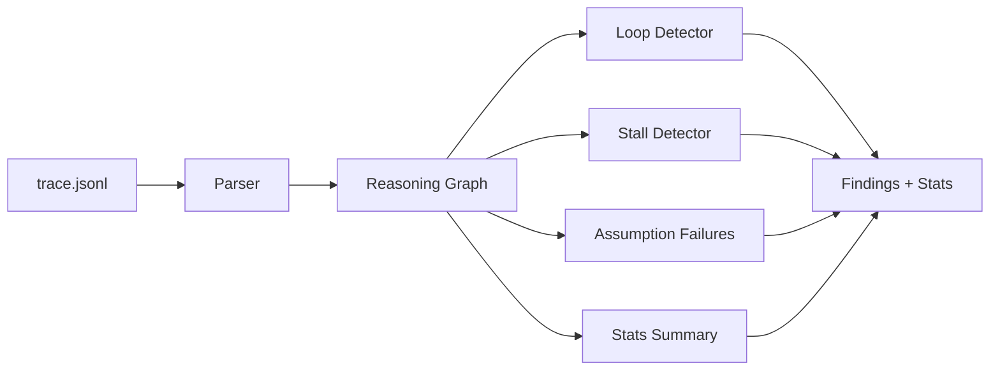

# agent-trace-map

[](https://github.com/medthemed/agent-trace-map/actions/workflows/ci.yml)
[](https://github.com/medthemed/agent-trace-map/releases)
[](LICENSE)

Map agent **reasoning loops** from JSONL traces. Detect infinite retries,
stalls, shared assumption failures, and the critical path to a crash.

OpenTelemetry spans tell you a tool ran for 12 seconds. `atm` tells you the
agent called the same failing endpoint five times because it never updated
its premise.

## Architecture



## Install

```bash
npm install
npm run build
```

## CLI

```bash
# human-readable report
node dist/cli.js analyze examples/loop-trace.jsonl

# machine-readable (stable envelope)
node dist/cli.js analyze examples/loop-trace.jsonl --format json

# compact operational summary (counts, durations, tools, finding rollup)
node dist/cli.js stats examples/loop-trace.jsonl
node dist/cli.js stats examples/loop-trace.jsonl --format json --top 3

# aggregate findings across a directory of traces
node dist/cli.js analyze-many examples/
node dist/cli.js analyze-many examples/ --format json

# tune thresholds
node dist/cli.js analyze examples/clean-trace.jsonl --stall-ms 2000 --loop-threshold 2

# pin thresholds in a config file
node dist/cli.js analyze examples/loop-trace.jsonl --config atm.config.json
```

## JSON pipe contract

`analyze`, `analyze-many`, and `stats` accept `--format json` (`--json` is
a shorthand). Every payload is a small envelope:

```json
{
  "schema_version": "1",
  "ok": true,
  "command": "analyze",
  "...": "command-specific fields"
}
```

`schema_version` is currently `"1"`. Additive fields may appear later;
existing fields will not be renamed or removed within the same major
schema version. Exit codes are unchanged by `--format json`.

| Command | Extra fields |
|---|---|
| `analyze` | `file`, `parse_errors`, `stats`, `findings`, `critical_path` |
| `analyze-many` | `dir`, `files[]`, `aggregate` |
| `stats` | `file`, `parse_errors`, `summary` |

```bash
# pipe-friendly: jq exits non-zero when ok is false
node dist/cli.js analyze trace.jsonl --format json | jq -e .ok
```

### Config (`atm.config.json`)

Optional project file loaded from the working directory (or `--config path`):

```json
{
  "loop_threshold": 3,
  "stall_ms": 5000,
  "stall_gap_ms": 3000,
  "assumption_failure_min": 2
}
```

Explicit CLI flags still override the file.

Dev alias: `npm run cli -- analyze examples/loop-trace.jsonl`

## Trace format (JSONL)

One event per line:

```json
{
  "span_id": "t1",
  "parent_span_id": "p0",
  "kind": "tool",
  "prompt_ref": "prompts/fix.md",
  "outcome": "fetch user profile failed",
  "duration_ms": 100,
  "ts": "2026-01-15T11:00:00.100Z",
  "metadata": { "tool": "http_get", "ok": false, "error_code": "ECONNREFUSED" }
}
```

`kind` is one of `plan | tool | reflect | fail | commit`.
Required fields: `span_id`, `kind`, `duration_ms`.

## Library

```ts
import {
  parseJsonl,
  buildGraph,
  analyze,
  summarizeStats,
  assertParseable,
  TraceParseError,
} from "agent-trace-map";

const { events, errors } = parseJsonl(jsonlText);
try {
  assertParseable(events, errors, "trace.jsonl");
} catch (err) {
  if (err instanceof TraceParseError) console.error(err.parse_errors);
  else throw err;
}

const graph = buildGraph(events);
const result = analyze(graph, { loopThreshold: 3, stallMs: 5000 });

for (const finding of result.findings) {
  console.log(finding.severity, finding.detector, finding.title);
}

const summary = summarizeStats(graph);
console.log(summary.duration.avg_ms, summary.tools[0]?.tool);
```

The runtime export catalog is frozen (`PUBLIC_API` / `PUBLIC_API_NAMES`) so
accidental mutation of the export table fails fast.

## Detectors

| Detector | What it catches |
|---|---|
| `loop` | N consecutive spans with the same kind/prompt/outcome signature |
| `stall` | Spans longer than `stallMs`, or idle gaps between siblings |
| `assumption_failure` | Multiple failures sharing one root-cause signature |
| `critical_path` | Ancestor chain to the first hard failure (informational) |

## Sample trace walkthrough

`examples/loop-trace.jsonl` is a 7-span retry storm. Walking it line by line:

| # | span_id | kind | What happened |
|---|---|---|---|
| 1 | `p0` | plan | Root plan: "Retry the network call until it works" |
| 2 | `t1` | tool | `http_get` fails with `ECONNREFUSED` |
| 3 | `t2` | tool | Same call, same error |
| 4 | `t3` | tool | Same call, same error |
| 5 | `t4` | tool | Same call, same error |
| 6 | `t5` | tool | Same call, same error — 5th identical retry |
| 7 | `f1` | fail | Agent gives up |

All five tool spans share `kind|prompt_ref|tool|outcome`, so the loop
detector flags one warning covering spans `t1…t5`. The shared
`ECONNREFUSED` root cause also trips the assumption-failure detector.
`critical_path` then reports `p0 → f1` (the fail span is a direct child
of the plan).

```bash
node dist/cli.js analyze examples/loop-trace.jsonl
node dist/cli.js stats   examples/loop-trace.jsonl
```

`analyze` is the deep report; `stats` is the quick triage rollup
(`http_get: 5 call(s) (5 failed)`, duration p95, finding counts).

## Batch analysis

`analyze-many` walks a directory of `*.jsonl` traces (non-recursive),
runs detectors on each, and prints a per-trace rollup plus an aggregate
findings table:

```bash
node dist/cli.js analyze-many examples/
```

```text
analyze-many: examples

file              spans  findings  status
---------------  ------  --------  ------
clean-trace.jsonl      7         0  ok
loop-trace.jsonl       7         3  ok
stall-trace.jsonl      5         1  ok

findings: 4

severity  detector            trace                  title
--------  ------------------  ---------------------  ------------------------------
warning   loop                loop-trace.jsonl       5 consecutive similar tool spans
error     assumption_failure  loop-trace.jsonl       5 failures share ECONNREFUSED
info      critical_path       loop-trace.jsonl       path to first failure
warning   stall               stall-trace.jsonl      span exceeded 12s

aggregate: 3 trace(s), 3 ok, 0 failed, 19 span(s), 4 finding(s)
  by_detector: loop=1 assumption_failure=1 critical_path=1 stall=1
  by_severity: warning=2 error=1 info=1
```

Exit code is `0` only when every trace analyzed successfully. The same
logic is available as a library:

```ts
import { analyzeMany, formatFindingsTable } from "agent-trace-map";

const batch = analyzeMany("traces/");
console.log(formatFindingsTable(batch));
```

## Examples

- `examples/clean-trace.jsonl` — healthy run, no findings
- `examples/loop-trace.jsonl` — retry storm + shared ECONNREFUSED failures
- `examples/stall-trace.jsonl` — 12s crawl stall

## Development

```bash
npm test
npm run typecheck
npm run build
```

See [docs/ARCHITECTURE.md](docs/ARCHITECTURE.md) for design details.
Releases are tracked in [CHANGELOG.md](CHANGELOG.md).

## License

MIT
